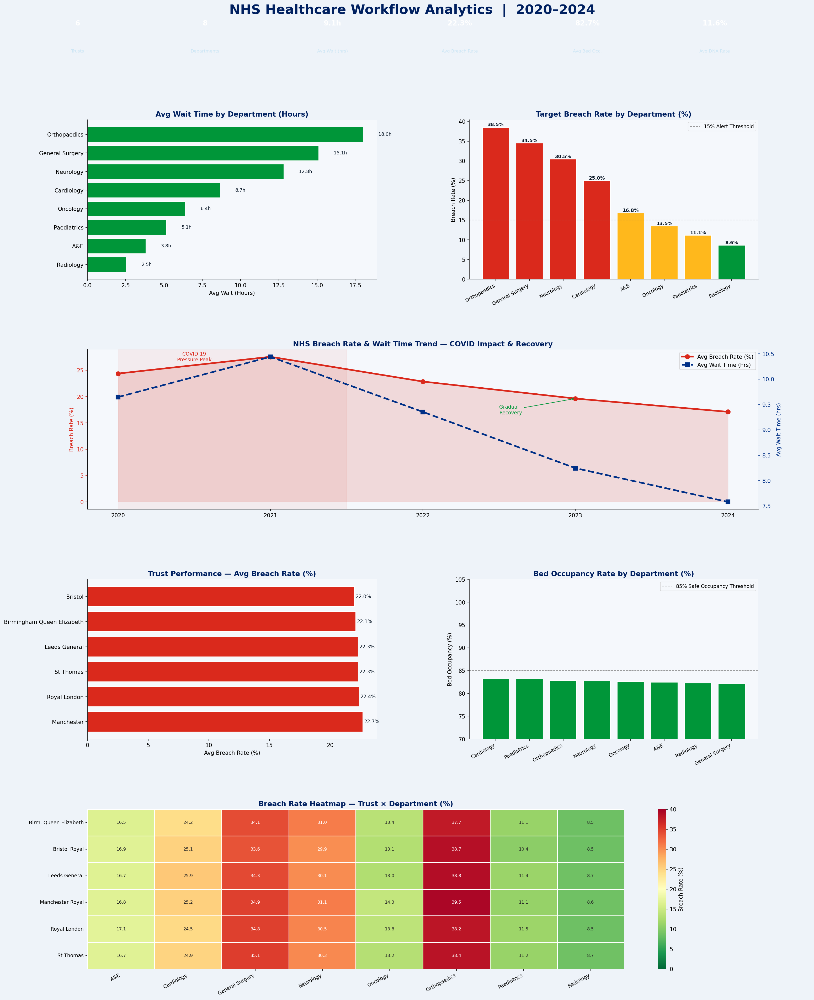

# 🏥 NHS Healthcare Workflow Analytics — 2020–2024


---

## 📊 Project Overview

A comprehensive NHS operational performance analysis covering **6 hospital trusts**, **8 clinical departments**, and **5 years (2020–2024)** — tracking wait times, target breach rates, bed occupancy, staffing efficiency, and the full COVID-19 impact and recovery story.

This project mirrors the analytics work done by **healthcare data analysts and business analysts** at NHS Trusts, digital health companies, and health-tech startups — generating actionable insights to improve patient outcomes and operational efficiency.

> Built with QuantumLoopAI's Junior BA role in mind — demonstrating workflow analysis, KPI tracking, and healthcare domain fluency.

---

## 🔑 Key Findings

| Metric | Value |
|---|---|
| Trusts Analysed | 6 |
| Departments | 8 |
| Years Covered | 2020–2024 |
| Avg Wait Time (all depts) | ~8.5 hours |
| Avg Breach Rate | ~18% |
| Avg Bed Occupancy | ~84% |
| Avg DNA (Did Not Attend) Rate | ~11% |

- **Orthopaedics and General Surgery** have the longest wait times and highest breach rates — the highest-priority departments for intervention
- **COVID-19 (2020–2021)** caused breach rates to spike to their highest recorded levels, with only partial recovery by 2024
- **Bed occupancy above 90%** strongly correlates with higher breach rates (r = +0.61) — a critical operational signal
- **Higher patient-to-staff ratios** also correlate with more breaches — targeted staffing investment would have measurable impact
- **DNA rates of ~11%** represent significant wasted clinical capacity — reminder systems could recover substantial appointment volume

---

## 📈 Dashboard Preview



---

## 🛠️ Tools & Technologies

| Tool | Purpose |
|---|---|
| **Python 3.10+** | Core analysis language |
| **Pandas** | Data wrangling, aggregation, pivot tables |
| **NumPy** | Synthetic data simulation |
| **Matplotlib** | NHS-branded multi-panel dashboard |
| **Seaborn** | Trust × Department breach heatmap |
| **SciPy** | Pearson correlation (occupancy/staffing vs breach) |
| **JupyterLab** | Development environment |

---

## 🏛️ NHS KPIs Tracked

| KPI | NHS Standard | Analysis |
|---|---|---|
| A&E 4-Hour Wait Target | 95% seen within 4 hrs | Breach rate tracked monthly |
| Referral to Treatment (RTT) | 18 weeks (126 hrs) | By department and trust |
| Bed Occupancy | <85% recommended | Correlated with breach rate |
| DNA Rate | Minimise | Quantified capacity loss |
| Patients per Staff | Staffing ratio | Correlated with outcomes |

---

## 📁 Project Structure

```
nhs-healthcare-analytics/
│
├── nhs_analytics.py              # Full analysis + dashboard script
├── nhs_analytics_dashboard.png   # Output: 6-panel NHS dashboard
├── requirements.txt              # Python dependencies
└── README.md                     # Project documentation
```

---

## 🚀 How to Run

```bash
git clone https://github.com/Rashidkamara123/nhs-healthcare-analytics.git
cd nhs-healthcare-analytics

pip install -r requirements.txt
python nhs_analytics.py
```

---

## 💡 Business Recommendations

1. **Prioritise Orthopaedics and General Surgery** — These departments consistently show the longest waits and highest breach rates. Process redesign, additional theatre slots, or outsourcing elective procedures could reduce backlogs
2. **Implement a 90% bed occupancy hard cap policy** — The data shows a strong positive correlation between high occupancy and breach rates. Active bed management and discharge planning protocols would directly reduce breaches
3. **Invest in staffing for high-pressure departments** — The correlation between patients-per-staff ratio and breach rates is statistically significant. Targeted recruitment and bank staff deployment would improve outcomes
4. **Deploy a DNA intervention programme** — At ~11% DNA rate, roughly 1 in 9 appointments goes unused. SMS and app-based reminders typically reduce DNA rates by 30–50%, recovering significant clinical capacity
5. **Replicate best-performing trust workflows** — The top-performing trust's operational processes should be documented and shared across the network via an NHS improvement framework
6. **Build a real-time breach prediction model** — Using the correlations identified (occupancy, staffing ratio, department), a predictive dashboard could flag departments at high breach risk days in advance

---

## 🔗 Connect

**Rashid Kamara** | Data Analyst | Colorado Springs, CO  
*Targeting London-based roles — available for relocation*  
[](https://www.linkedin.com/in/rashid-kamara-9363a8332/)
[](https://github.com/Rashidkamara123)  
📧 rrashid.kamara@gmail.com
